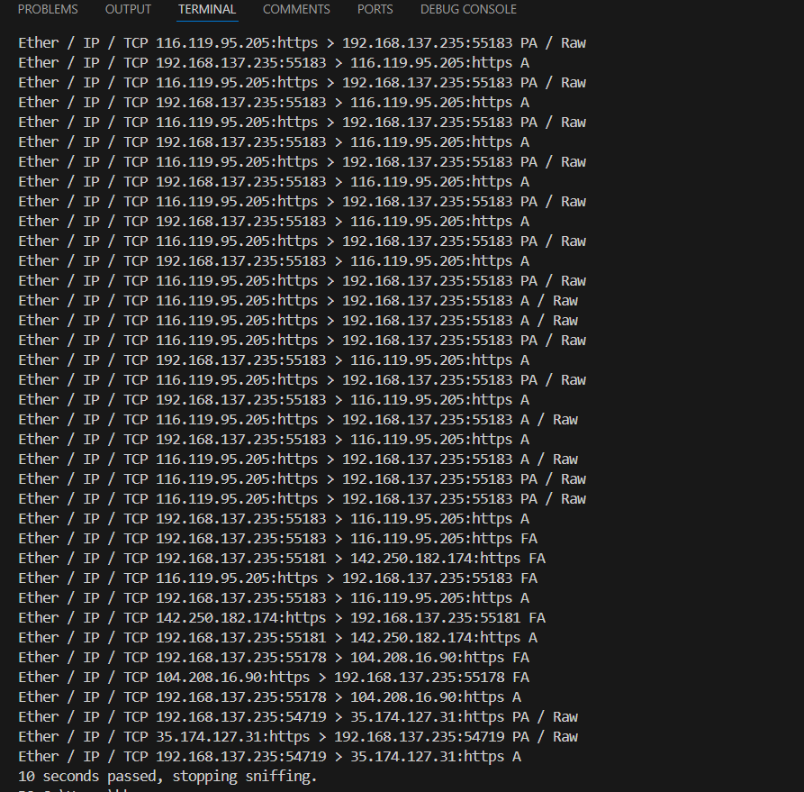

## PRODIGY_CS_05
# Packet Sniffer with Scapy

This project is a Python-based **Packet Sniffer** built using the `scapy` library. The sniffer captures network packets in real-time, extracts key information (e.g., IP addresses, ports, protocols, and payloads), and displays it in the terminal.

## Features
- Captures packets from the specified network interface.
- Supports protocols like IP, TCP, UDP, and extracts their respective details.
- Displays packet payloads (if available).
- User-friendly and lightweight.

---

## Requirements

### 1. **System Requirements**
- A **Linux** or **Windows** system.
  - For Windows: Install [**Npcap**](https://npcap.com/dist/npcap-1.80.exe) (successor to WinPcap) for packet sniffing.
  - For Linux: Ensure you have root/administrator privileges to sniff packets.

### 2. **Python Version**
- Python 3.7 or higher.

### 3. **Required Libraries**
- `scapy`: Install using pip.

```bash
pip install scapy
```

Output:

